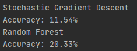
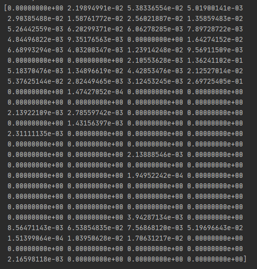

```{r setup, include=FALSE}
library(tidyverse)
loan_data <- read_csv("loans_full_schema.csv")
```

```{r explore, include=FALSE}
glimpse(loan_data)
```
## The Data
This dataset has 10,000 observations and 55 variables. Each observation is an accepted loan through the Lending Club platform. The variables describe the attributes of the person who requested the loan as well as the terms of the loan. Some problems with this dataset are several observations that have missing data for certain variables. This is most likely because that variable does not apply to them (like if they aren't applying for a joint loan) so the data is NA. Another note is that the "issue_month" variable contains both the month and year of when the loan was issued. Splitting this into two separate variables will make the data easier to work with. Additionally, for the modeling part of this case study, it's important to note which variables should be used to estimate interest rates. Only the attributes of the person requesting the loan should be used in modeling, not the attributes of the loan itself. Differentiating the two will be important for creating a feature set.

## Observations

There is no significant difference between loan grades of joint applications versus individual applications. This is counterintuitive to my common sense, but this is most likely a side effect of the dataset being accepted loans.

```{r, echo=FALSE, message=FALSE}
loan_data %>%
  group_by(application_type) %>%
  mutate(type_total = n()) %>%
  group_by(application_type, grade) %>%
  mutate(perc = n()/type_total) %>%
  ggplot(aes(x=application_type, y=perc, fill=grade)) +
  geom_bar(stat="identity", position="dodge") +
  theme_minimal() +
  labs(
    title="Joint vs. Individual Loan Grade proportions",
    x = "",
    y = "Proportion of loans",
    fill = "Loan Grade",
    caption = "Data includes accepted loans from Lending Club"
  )
```
There is a definite correlation between the grade of the loan and the purpose for it. Loans for credit cards, homes, home improvements, and cars tend to have the highest grades. On the other hand, loans for vacations, moving, renewable energy, and small business tend to have the lowest grades.

```{r, echo=FALSE, message=FALSE}
loan_data %>%
  group_by(loan_purpose) %>%
  mutate(is_joint_total = n()) %>%
  group_by(loan_purpose, grade) %>%
  mutate(perc = n()/is_joint_total) %>%
  ggplot(aes(x=grade, y=perc, label=as.factor(loan_purpose), fill=grade)) +
  geom_bar(stat="identity", position="dodge") +
  facet_wrap(~loan_purpose) +
  theme_minimal() +
  theme(legend.position="none") +
  labs(
    title="Loan grades by Purpose",
    x = "Loan Grade",
    y = "Proportion of loans",
    caption = "Data includes accepted loans from Lending Club"
  )
```

This graph is hard to interpret. Under a certain annual income, there is no strong correlation between interest rate and income. But above a certain threshold, higher incomes indicate higher grades. Another interesting observation from this graph is that interest rates are not continuous, they have specific values.

```{r, echo=FALSE, message=FALSE}
loan_data %>%
  filter(application_type == "individual", annual_income < 250000) %>%
  ggplot(aes(x=annual_income, y=interest_rate, color=as.factor(grade))) +
  geom_point() +
  theme_minimal() +
  labs(
    title = "Annual Income vs. Interest Rate",
    x = "Annual Income",
    y = "Interest Rate",
    color = "Loan Grade",
    caption = "Data includes accepted loans from Lending Club\nwhere the applicant made less than $250,000 annually"
  )
```

There appears to be a slight correlation between loan grade and type of homeownership. There appears to be no distinction between owning and mortgaging a house, but people who rent a home have lower grades than the aforementioned.

```{r, echo=FALSE, message=FALSE}
loan_data %>%
  group_by(homeownership) %>%
  mutate(type_total = n()) %>%
  group_by(homeownership, grade) %>%
  mutate(perc = n()/type_total) %>%
  ggplot(aes(x=homeownership, y=perc, fill=grade)) +
  geom_bar(stat="identity", position="dodge") +
  theme_minimal() +
  labs(
    title = "Loan Grades by Home Ownership",
    x = "",
    y = "Proportion of Loans",
    fill = "Loan Grade",
    caption = "Data includes accepted loans from Lending Club"
  )
```

Income verification plays a large role in loan grading. For reasons that allude me, unverified incomes have the highest loan grades while verified incomes have a normal distribution.

```{r, echo=FALSE, message=FALSE}
loan_data %>%
  filter(application_type == "individual") %>%
  group_by(verified_income) %>%
  mutate(type_total = n()) %>%
  group_by(verified_income, grade) %>%
  mutate(perc = n()/type_total) %>%
  ggplot(aes(x=verified_income, y=perc, fill=grade)) +
  geom_bar(stat="identity", position="dodge") +
  theme_minimal() +
  labs(
    title = "Loan Grades by Income Verification",
    x = "",
    y = "Proportion of Loans",
    color = "Loan Grade",
    caption = "Data includes accepted loans from Lending Club"
  )
```

Overall, state does not appear to play a large factor in interest rates outside of a few exceptions. The state with the highest average interest rate is Hawaii at `r round((loan_data %>% filter(state == "HI") %>% summarize(out=mean(interest_rate)))$out, 2)`%. The state with the lowest average interest rate is South Dakota at `r round((loan_data %>% filter(state == "SD") %>% summarize(out=mean(interest_rate)))$out, 2)`%.

```{r, echo=FALSE, message=FALSE}
loan_data %>%
  mutate(state=fct_reorder(state, interest_rate)) %>%
  ggplot(aes(x=reorder(state, interest_rate, na.rm=TRUE), y=interest_rate)) +
  geom_boxplot() +
  scale_x_discrete(guide = guide_axis(n.dodge=2)) +
  coord_flip() +
  theme_minimal() +
  labs(
    title = "Interest Rates by State",
    x = "State",
    y = "Interest Rate",
    caption = "Data includes accepted loans from Lending Club"
  )
```

## Model prediction
The feature set used to predict interest rates includes all given variables except for, variables relating to the loan itself, any variables relating to joint income, and the job title. All joint applicants were removed from the dataset entirely. The feature set ended up containing 36 features and 8,505 samples. There are two types of features in this data set, categorical and numerical. To prep the data for use, all categorical variables were encoded using a one-hot encoder. All null values were replaced with the median value from that feature. The two models I used to model interest rates were a Random Forest Classifier and a stochastic Gradient Descent Classifier. Unfortunately, the highest accuracy achieved was only ~21% by the random forest. The stochastic gradient descent only had ~11% accuracy.



## Improvements
Given more time to complete this assignment, I would fine-tune the features to only be the most important ones and try more models. The random forest classifier shows the weights it assigned to each feature during training. Using this information (shown below), I can prune the least important features and hopefully get better results. I would also be able to add joint accounts to the model and see if they can be supported as well. My biggest assumption was that the interest rates are not a continuous variable. I assumed this because the "Annual Income vs. Interest Rate" graph showed that interest rates had specific values within each grade.

